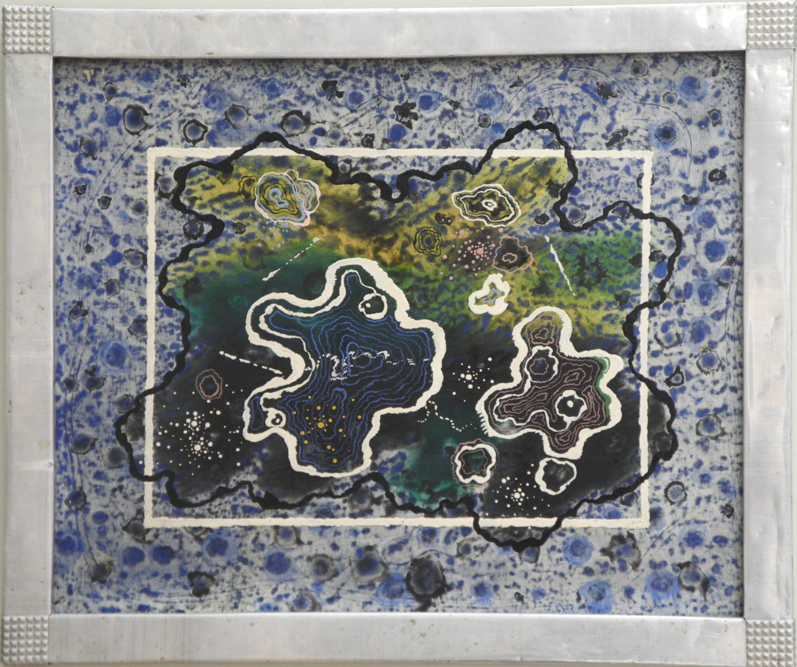
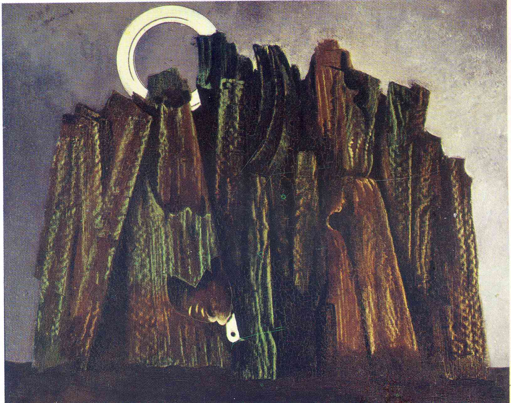
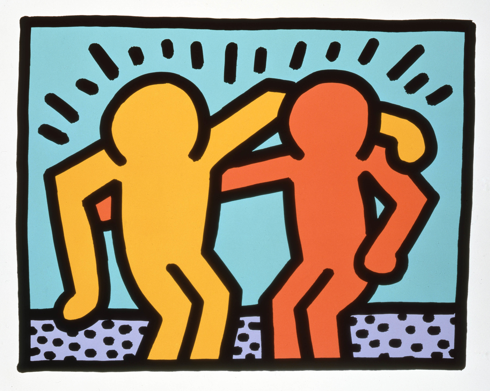

## smARTy pants
### Predicting modern art styles using image recognition  
Created by **Stuart King** - November 2017

### Table of Contents
- [Overview](#overview)
- [Data Wrangling](#data-wrangling)
- [Modeling](#modeling)
  * [Keras ResNet50](#keras-with-resnet50-baseline)
  * [TensorFlow Inception v3](#tensorflow-with-inception-v3-baseline)
  * [TensorFlow](#tensorflow)
- [Results](#results)
- [Next Steps](#next-steps)
- [Make Predictions](#make-predictions)
- [Notes](#notes)
- [Acknowledgements](#acknowledgements)

### Overview
I've always wanted to be able to speak intellectually about art. Sadly, despite my college Art Appreciation professor's best efforts, the nuances of modern art never truly sunk in. In an attempt to use machine learning to make me sound smarter than I am, I have created an art image classifier to predict one of ten modern art styles a piece of art falls into. Below is a description of the steps taken and results achieved.

### Data Wrangling
The Kaggle [Painter By Numbers](https://www.kaggle.com/c/painter-by-numbers) competition challenges participants to use computer vision to examine pairs of paintings and determine if they are by the same artist. Included in this challenge is a dataset of over 100,000 images with image-specific metadata, including the particular style of art the image is classified into. Using this large dataset, I sampled 200 images from each style I wanted to focus on - **Impressionism, Expressionism, Surrealism, Cubism, Abstract Art, Fauvism, Pop Art, Art Deco, Op Art, and Art Nouveau (Modern)** - to create a project dataset of 2,000 images.

To prepare the data, I pre-processed each image by converting the image into a normalized pixel array [shape (224,224,3) for ResNet50 and shape (299,299,3) for Inception v3]. Image labels (art styles) were encoded into a range of values between 0 and 9, and for some models, then converted into one-hot vector arrays. Finally, the prepared dataset of image pixel arrays and labels were split into training, validation, and test sets.

### Modeling
I developed three separate Convolutional Neural Network (CNN) models for this activity.

#### Keras with ResNet50 baseline
I used the Keras neural network API due to the deep learning models and their pre-trained weights that Keras has made publicly available. In particular, I wanted to use the **ResNet50** model with weights pre-trained on the ImageNet dataset. Because ResNet50 was trained on millions of images, it is already able to detect basic features such as edges and colors. Using this as my base model, I was then able to add fully connected layers specific to my image dataset to fine tune ResNet50 and apply its understanding of basic objects to identify features that distinguish different art styles.

**Base Model:**  
ResNet50 trained on ImageNet dataset  

**Fully Connected Layers:**
- Flatten
- Dense (activation = relu)
- Dense (10 classes of art, activation = softmax)  

**Compiled Model:**
- Optimizer = stochastic gradient descent (SGD)
- Loss = categorical cross-entropy

#### TensorFlow with Inception v3 baseline
Using TensorFlow's `inception_v3_arg_scope` function I was able to restore the latest pre-trained Inception v3 model and freeze all layers up until the last layer before the output layer. I replaced this layer with the correct number of outputs for my classification task (10), and added in several other essential elements to train the model (e.g. loss function, optimizer). This architecture resembles the approach taken for the Keras ResNet50 model, in which the model takes advantage of the learning accomplished by the pre-trained Inception v3 model and then applies it to my particular computer-vision project.

**Base Model:**  
Inception v3 trained on ImageNet dataset

**Fully Connected Layers:**  
- Dense (10 classes of art, activation = softmax)

**Compiled Model:**  
- Optimizer = Adam
- Loss = categorical cross-entropy

#### TensorFlow
I also constructed a standard CNN model using the TensorFlow library. In contrast to the two other models, this model did not benefit from transfer learning.

**Base Model:**  
Three convolutional layers with max pooling and relu activation

**Fully Connected Layers:**
- Flatten
- Dense (activation = relu)
- Dense (activation = relu)
- Dense (10 classes of art, activation = softmax)

**Compiled Model:**  
- Optimizer = Adam
- Loss = categorical cross-entropy

### Results
All models were trained using an AWS DeepLearning AMI CUDA 8 Ubuntu EC2 instance

#### Keras ResNet50
Epochs: 30  
Batch size: 25  
Test accuracy: 57.80%

#### TensorFlow Inception v3
Epochs: 40  
Batch size: 25  
Test accuracy: 43.25%

#### TensorFlow (standard)
Epochs: 50  
Batch size: 20  
Test accuracy: 18.75%

The above results were certainly not as high as I had hoped, but it is important to temper expectations given the difficulty of this computer-vision task. Random guessing would result in an average correct style classification of 10 percent, thus 58 percent accuracy might not be that bad...

To supplement these results, I returned the top five art style predictions for three images.

#### Image #1  
**Actual style:**  
Abstract Art  

**Keras ResNet50 - Top 5 Predictions:**  
Pop Art: 48.64%  
Art Nouveau (Modern): 18.67%  
Surrealism: 9.60%  
Abstract Art: 7.16%  
Art Deco: 4.39%

**TensorFlow Inception v3 - Top 5 Predictions:**  
Art Nouveau (Modern): 29.58%  
Abstract Art: 25.58%  
Op Art: 19.12%  
Expressionism: 13.29%  
Cubism: 5.67%  

**TensorFlow (standard) - Top 5 Predictions:**  
Abstract Art: 97.45%  
Op Art: 2.47%  
Expressionism: 0.06%  
Impressionism: 0.02%  
Cubism: 0.01%  



#### Image #2
**Actual style:**  
Surrealism

**Keras ResNet50 - Top 5 Predictions:**   
Expressionism: 76.49%  
Surrealism: 11.88%  
Abstract Art: 4.36%  
Fauvism: 2.66%  
Cubism: 1.89%  

**TensorFlow Inception v3 - Top 5 Predictions:**  
Expressionism: 93.97%  
Cubism: 5.87%  
Art Nouveau (Modern): 0.06%  
Abstract Art: 0.05%  
Surrealism: 0.02%  

**TensorFlow (standard) - Top 5 Predictions:**  
Surrealism: 42.47%  
Impressionism: 21.90%  
Cubism: 20.16%  
Expressionism: 9.75%  
Op Art: 2.58%  



#### Image #3
**Actual style:**  
Pop Art

**Keras ResNet50 - Top 5 Predictions:**  
Pop Art: 96.31%  
Op Art: 2.33%  
Abstract Art: 1.01%  
Expressionism: 0.28%  
Cubism: 0.03%  

**TensorFlow Inception v3 - Top 5 Predictions:**  
Pop Art: 87.70%  
Op Art: 5.65%  
Expressionism: 5.60%  
Cubism: 0.44%  
Abstract Art: 0.36%  

**TensorFlow (standard) - Top 5 Predictions:**  
Fauvism: 99.07%  
Abstract Art: 0.91%  
Cubism: 0.02%  
Art Deco: 0.00%  
Pop Art: 0.00%  



As evident from the above results, none of the models were correct for all three images. Again, these results aren't entirely surprising given the difficulty of the image recognition objective. In contrast to other computer-vision object identification projects with high performance, no two pieces of art are the same.

### Next Steps
While the models demonstrate some promise, they all has a long way to go before anyone would be able to confidently trust their output. Tweaks to the models' architectures make sense for immediate next steps, including the addition of supplemental fully connected layers, and automatic adjustments to the learning rate as model performance plateaus.

### Make Predictions
All three models can be used to make predictions on new images. For the **Keras ResNet50** model, to make predictions you will need to download and save in a consolidated location the following:

```
+-- cnn_resnet_predict.py
+-- data/
    +-- class_dict.pkl
+-- saved_model/
    +-- resnet_model_weights.h5
    +-- resnet_model.json
```
Once the necessary files and folders are compiled, you can make predictions using the command line as follows:
```
python cnn_resnet_predict.py path_to_image
```

Due to space limitations, the supporting model metadata, weights, and checkpoints for the TensorFlow models are not included in this repository. However, the provided code can be downloaded and run on a local machine, which will create the necessary model documentation. These files, combined with the original data files from Kaggle will complete the requisite file requirements to train the models and make predictions.

### Notes
As mentioned above, due to file size and storage limitations, the original images and training and test datasets have been omitted from this repository. Re-creation of these files can be performed by running the scripts after downloading the original image library from Kaggle.

### Acknowledgements
Segments of my code were adapted from the following three sources:
- Jen Waller's [Wildflower Finder](https://github.com/jw15/wildflower-finder) project
- Aurélien Géron's **Hands-On Maching Learning with Scikit-Learn & TensorFlow** and accompanying Jupyter notebook for Chapter 13: Convolutional Neural Networks
- Ankit Sachan's Tensorflow Tutorial 2: image classifier using convolutional neural network [blog post](http://cv-tricks.com/tensorflow-tutorial/training-convolutional-neural-network-for-image-classification/) and [GitHub repository](https://github.com/sankit1/cv-tricks.com/tree/master/Tensorflow-tutorials/tutorial-2-image-classifier)

&copy; Stuart King 2017. All rights reserved.
